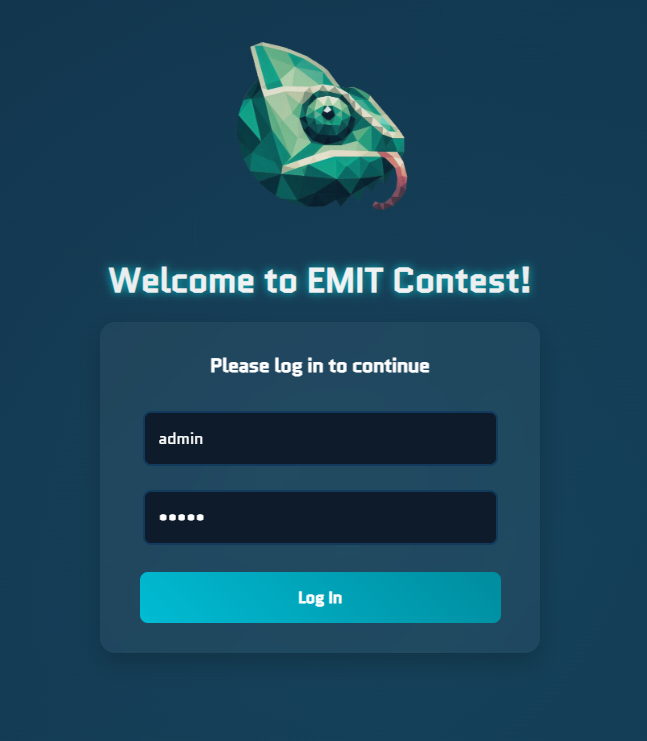
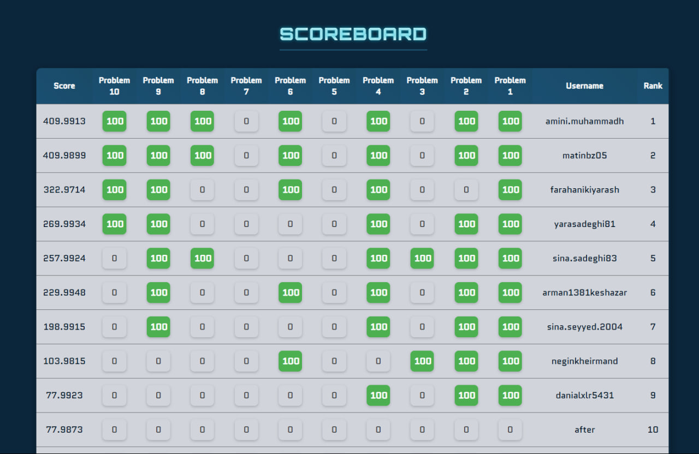

# EMIT Front-end

The **EMIT Front-end** is a user-focused interface developed for the EMIT contest platform. It provides a smooth and responsive experience for contestants to interact with the system, track scores, and access problem statements.

## Features

### 🔐 Login Page

-   Authenticates users using JWT-based login.
-   Connects with the backend via secure API calls.
-   Grants access to the main interface upon successful login.



### 🏆 Main Page

-   **Navigation Bar**: Enables easy switching between different sections such as the scoreboard and problem pages.
-   **Scoreboard**: Displays the real-time ranking of teams, including detailed breakdowns of scores per problem.



### 📄 Problems Page

-   Lists all contest problems.
-   Allows users to download problem files directly for offline solving.

## Tech Stack

-   **React**
-   **JWT** for authentication
-   **API integration** with the backend
-   **Modular and responsive design**

## Getting Started

1. Clone the repository:
    ```bash
    git clone https://github.com/mahsa-kashani/Emit-Frontend.git
    ```
2. Install dependencies:
    ```bash
    npm install
    ```
3. Run the development server:
    ```bash
    npm run dev
    ```

## License

This project is licensed under the MIT License. See the [LICENSE](./LICENSE) file for more details.

---

Built with ❤️ for the EMIT Contest.
